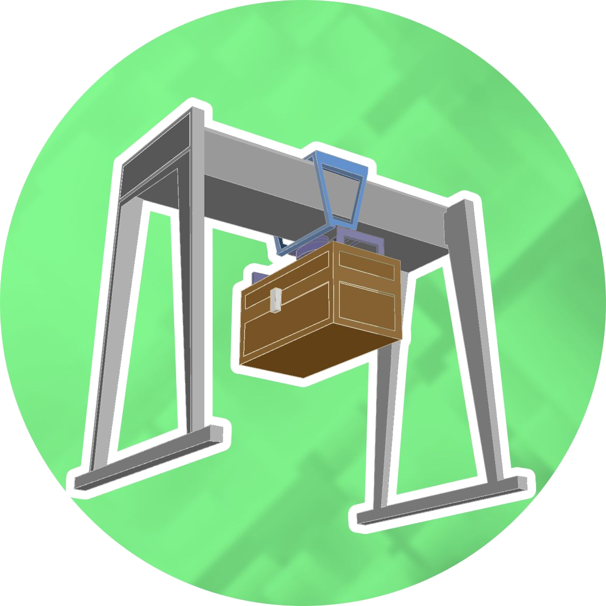

<div align="center">
  

  # Stockpile

  **A Minecraft storage manager for [CC: Tweaked](https://tweaked.cc/).**

  Index millions of items, search the database with NBT-aware regex filters, move them between named inventory groups, and automate using a dedicated scripting language.

  [](LICENSE)
  [](https://tweaked.cc/)
  [](https://www.minecraft.net/)
  [](https://www.lua.org/)

</div>

---

Stockpile turns a room full of chests into a queryable database. The **server** computer indexes every connected inventory, compresses the index to a few kilobytes on disk, and exposes a Rednet API. The **client** computer runs a full graphical UI built with Basalt to browse, search, move, and automate that storage.

## Highlights

| | |
|---|---|
| **Blazingly fast** | Transfer up to **128,000 items per second** by parallelizing every `pushItems` call. Database searches take less than a few miliseconds. |
| **Compressed database** | A **350,000 items** storage (≈100 double chests) uses **24 Kb** of real disk space. |
| **NBT-aware** | Search and filter by any NBT attribute using Lua patterns — enchantments, custom names, potion effects... |
| **Named inventory groups** | Define subsets of chests as `input`, `output`, `storage`, `farm`, or anything else. Move items between them with one call. |
| **GUI client** | A full tabbed interface built on Basalt2: search results with keyboard navigation, a group editor, and a live usage bar. |
| **Automation DSL** | Write declarative trigger→action pairs in a simple scripting language: `period(60) and item_qty(coal, farm, <, 64) → scan_group(input)`. |
---

## Limitations

- **Fixed slot size.** The compression format assumes every item stacks to at most 64 and every inventory slot holds at most one item type. Modded inventories like Storage Drawers break this and are not supported.
- **NBT visibility.** CC: Tweaked's `getItemDetail` cannot read some NBT — most notably the contents of shulker boxes, the potency/duration of potions, and anything inside a nested container.
- **External mutation.** If a player takes items out of a chest by hand while Stockpile is running, the database will drift. You need to rescan affected groups periodically. Automation pairs can do this for you (`period(300) → scan_group(input)`).
- **No fluids.** Liquid storage is not currently modelled. *Coming soon™*

---
## Install

**Prerequisites** 

- Use networking wire and wired modems to connect chests or barrels (your storage) to two computers (server and client)
- Make sure you use an advanced computer (gold computer) for the client install.

After doing that, install each server and client using this command in the console :

```bash
wget run https://raw.githubusercontent.com/MintTee/Stockpile/refs/heads/main/installer.lua
```
