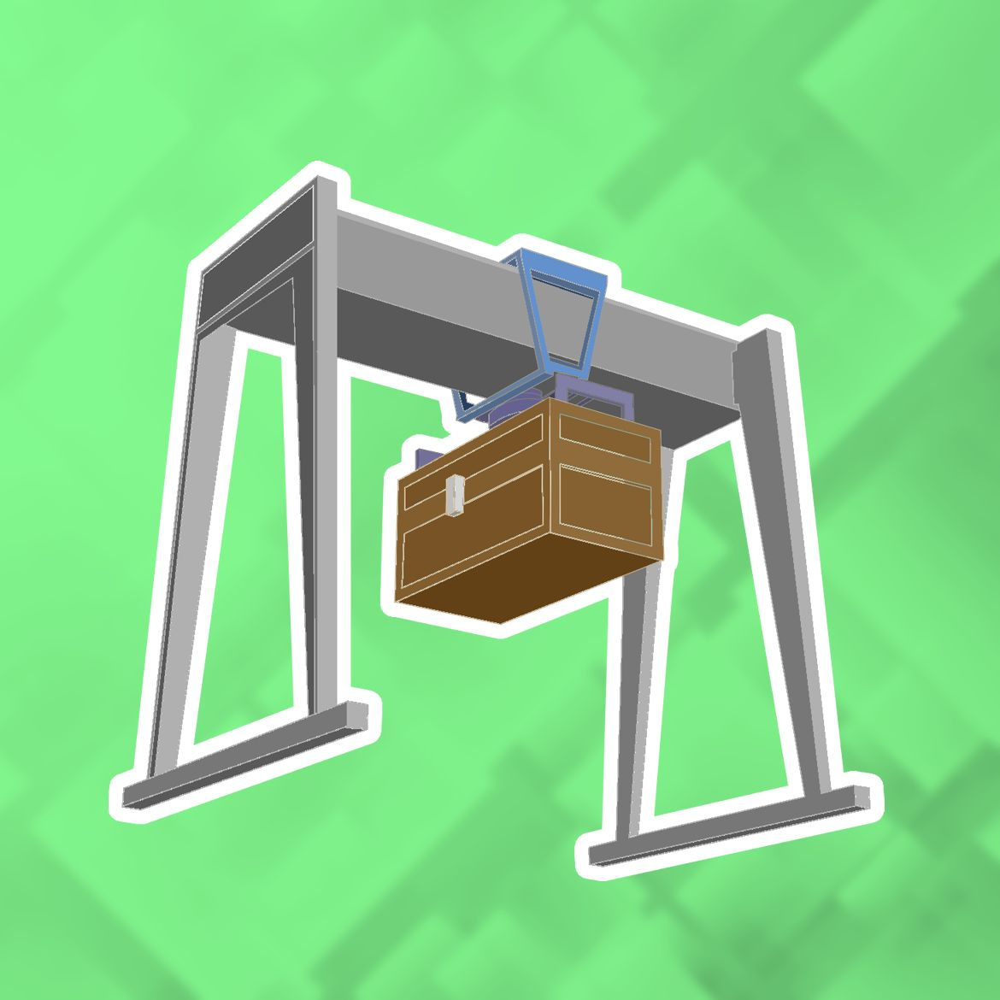

<div align="center">
  

  # Stockpile

  **A backend-grade Minecraft storage manager for [CC: Tweaked](https://tweaked.cc/).**

  Index millions of items, search them with NBT-aware regex, move them between named inventory groups, and automate it all — from any computer on your Rednet network.

  [](LICENSE)
  [](https://tweaked.cc/)
  [](https://www.minecraft.net/)
  [](https://www.lua.org/)

</div>

---

Stockpile turns a warehouse full of chests into a queryable database. The **server** computer indexes every connected inventory, compresses the index to a few kilobytes on disk, and exposes a Rednet API. The **client** computer runs a full graphical UI built with Basalt to browse, search, move, and automate that storage.

The name is a nod to Dwarf Fortress — where a *stockpile* is the difference between an organized fortress and a floor covered in socks.

---

## Table of contents

- [Highlights](#highlights)
- [Quick start](#quick-start)
- [The client](#the-client)
- [Automation DSL](#automation-dsl)
- [The server](#the-server)
- [API reference](#api-reference)
- [Architecture](#architecture)
- [Technical deep dive](#technical-deep-dive)
- [Configuration](#configuration)
- [Limitations](#limitations)
- [Roadmap](#roadmap)
- [Contributing](#contributing)
- [License](#license)

---

## Highlights

| | |
|---|---|
| **Blazingly fast** | Transfer up to **128,000 items per second** by parallelizing every `pushItems` call through a coroutine queue. Average database search time: **under 10 ms**. |
| **Compressed to the byte** | A 350,000-item index (≈100 double chests) fits in **24 KB** on disk. That's **14,400 items per kilobyte** — small enough to live on a floppy disk rotation. |
| **NBT-aware** | Search and filter by any NBT attribute using Lua patterns — enchantments, custom names, potion effects, whatever the game exposes. |
| **Named inventory groups** | Define arbitrary subsets of chests as `input`, `output`, `storage`, `sorted_iron`, or anything else. Move items between them with one call. |
| **GUI client** | A full tabbed interface built on Basalt: search results with keyboard navigation, a group editor, a live usage bar, and persistent UI state across reboots. |
| **Automation DSL** | Write declarative trigger→action pairs in a tiny Lua-flavoured language: `period(60) and item_qty(coal, input, <, 64) → scan_group(input)`. |
| **Persistent** | The database survives reboots. The client remembers your filters, your selections, and your automation pairs. |

---

## Quick start

You need **at least two CC: Tweaked computers** with wireless or wired modems, and any number of inventories (chests, barrels, drawers…) connected to the server via the peripheral network.

### Install the server

On the computer that has access to every chest, in a CraftOS shell:

```bash
wget run https://raw.githubusercontent.com/MintTee/Stockpile/refs/heads/main/installer.lua